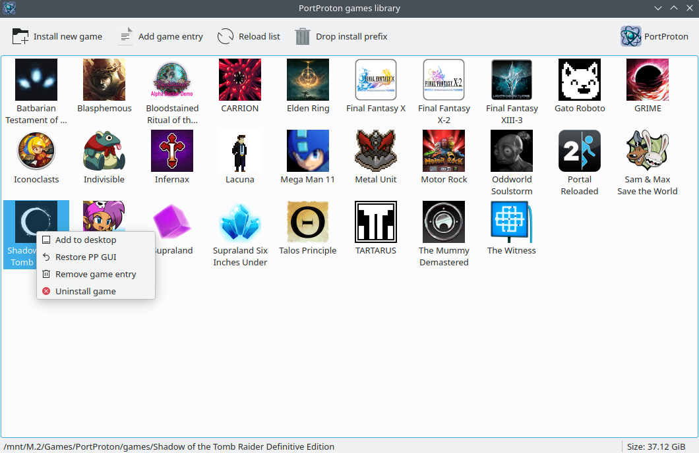

Небольшая обвязка для удобной установки и запуска игр с помощью PortProton

Можно закинуть куда нибудь в $HOME/.local/bin или другой путь указанный в PATH и запускатть через pp-games-lib. Ну или ярлык на рабочий стол добавить.
Не забыть сделать `chmod +x pp-games-lib`

При запуске ищет файл `$HOME/.local/share/applications/PortProton.desktop`, который создается при его установке (`PortProton/data/scripts/setup.sh`), для определения его местоположения. В качестве fallback считается что порт установлен в `$HOME/.local/share/PortWINE/PortProton` и у него иконка `/usr/share/pixmaps/portproton.png` (например если PortProton установлен из пакета)

Игры обязательно нужно устанавливать в `C:\Games`

* **Install new game** - проверяет папку Games в префиксе INSTALL (`PortProton/data/prefixes/INSTALL/drive_c/Games`) на наличие новых игр. Если ничего не находит, предлагает запустить установщик игры. По окончании установки игра перемещается в `PortProton/games`
* **Add game entry** - позволяет добавить новую запись из уже установленных игр
* **Drop install prefix** - полностью удаляет префикс INSTALL

